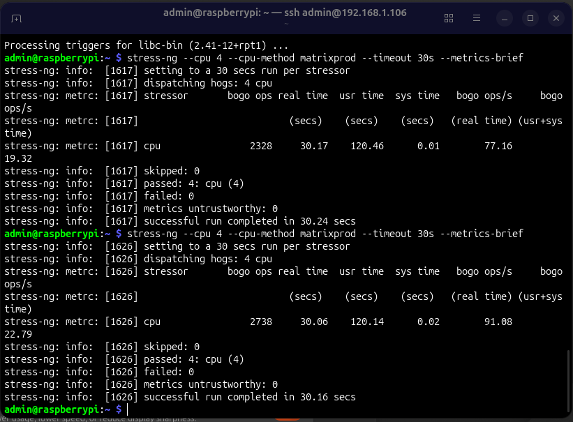
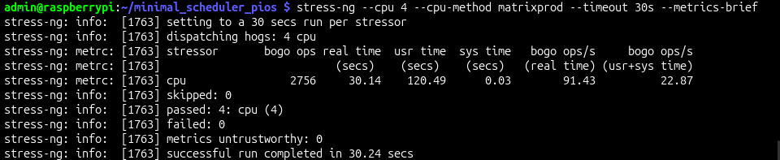

# MLFQ Scheduler using `sched_ext` for Raspberry Pi 4B

## Giới thiệu

Dự án này hiện thực **cơ chế lập lịch đa mức phản hồi (Multi-Level Feedback Queue – MLFQ)** bằng cách sử dụng **`sched_ext` (Scheduler Extensions)** của Linux. Thay vì can thiệp trực tiếp vào mã nguồn kernel, `sched_ext` cho phép xây dựng và thử nghiệm các thuật toán lập lịch mới thông qua **eBPF**, giúp quá trình phát triển linh hoạt, an toàn và dễ đánh giá hiệu năng.

Mục tiêu chính của dự án là:
- Nghiên cứu kiến trúc `sched_ext` trong Linux hiện đại
- Thiết kế và hiện thực thuật toán MLFQ bằng eBPF
- Đánh giá hành vi lập lịch và khả năng mở rộng so với các scheduler truyền thống

---

## Kiến thức nền

### MLFQ (Multi-Level Feedback Queue)

MLFQ là một thuật toán lập lịch ưu tiên động, trong đó:
- Tiến trình được phân vào **nhiều hàng đợi** với mức ưu tiên khác nhau
- Tiến trình mới thường bắt đầu ở hàng đợi ưu tiên cao
- Nếu sử dụng hết time slice, tiến trình sẽ bị **giảm mức ưu tiên**
- Tiến trình nhường CPU sớm có thể được giữ hoặc tăng ưu tiên

Cơ chế này giúp:
- Đáp ứng tốt cho tiến trình tương tác
- Hạn chế starvation
- Cân bằng giữa throughput và latency

### sched_ext

`sched_ext` là một framework mới trong Linux cho phép:
- Viết scheduler tùy chỉnh bằng **eBPF**
- Hook vào các sự kiện lập lịch (enqueue, dequeue, dispatch, tick, …)
- Chạy scheduler trong kernel nhưng vẫn giữ tính an toàn của eBPF

---

## Kiến trúc dự án

Dự án bao gồm hai phần chính:

```
.
├── bpf/
│   ├── mlfq.bpf.c          # Chương trình eBPF hiện thực MLFQ
│   ├── scx_common.bpf.h    # Helper và macro cho sched_ext
│   └── vmlinux.h           # BTF header
├── user/
│   ├── main.c              # Chương trình user-space loader
│   └── mlfq.skel.h         # Skeleton sinh bởi bpftool
├── Makefile
└── README.md
```

### Thành phần chính

- **mlfq.bpf.c**  
  - Cài đặt các hook của `struct_ops` cho `sched_ext`
  - Quản lý nhiều Dispatch Queue (DSQ) tương ứng với các mức ưu tiên
  - Thực hiện logic tăng/giảm ưu tiên và cấp phát time slice

- **User-space loader**  
  - Nạp BPF object vào kernel
  - Đăng ký scheduler MLFQ với `sched_ext`
  - Theo dõi trạng thái và log khi cần

---

## Thiết kế thuật toán

- Số mức ưu tiên: *N* (cấu hình bằng macro)
- Mỗi mức tương ứng với một **DSQ riêng**
- Tiến trình mới được enqueue vào mức ưu tiên cao nhất
- Khi tiến trình sử dụng hết time slice:
  - Bị hạ xuống DSQ có mức ưu tiên thấp hơn
- Scheduler luôn chọn tiến trình từ DSQ có ưu tiên cao nhất còn dữ liệu

Luồng xử lý chính:
1. `enqueue` – xác định mức ưu tiên ban đầu
2. `dispatch` – chọn DSQ phù hợp
3. `running` / `tick` – theo dõi thời gian chạy
4. `stopping` – cập nhật lại mức ưu tiên

---

## Yêu cầu hệ thống

- Linux kernel **>= 6.6** (có hỗ trợ `sched_ext`)
- BTF enabled kernel (`CONFIG_DEBUG_INFO_BTF=y`)
- Clang / LLVM
- libbpf (phiên bản mới)
- bpftool

---

## Build và chạy

```bash
make clean
make
sudo ./mlfq_runner
```

Sau khi chạy thành công, scheduler MLFQ sẽ được đăng ký và thay thế scheduler mặc định cho các task đủ điều kiện.

---

## Kết quả và đánh giá

- Scheduler hoạt động ổn định với workload hỗn hợp (CPU-bound và interactive)
- Tiến trình tương tác được phản hồi nhanh hơn so với FIFO đơn giản
- Không cần patch kernel, dễ thử nghiệm và rollback

Chi tiết đánh giá hiệu năng bằng:
`stress-ng --cpu 4 --cpu-method matrixprod --timeout 30s --metrics-brief`

Kết quả:

TH1: Khi sử dụng cơ chế lập lịch mặc định của Raspberry Pi



TH2: Khi sử dụng cơ chế lập lịch MLFQ cho Raspberry Pi



## Hạn chế

- MLFQ chưa có cơ chế aging nâng cao
- Chưa tối ưu cho hệ thống NUMA
- Chưa có cơ chế debug/trace chi tiết cho từng DSQ

---

## Hướng phát triển

- Bổ sung aging để giảm starvation
- Cho phép cấu hình động số mức ưu tiên
- So sánh trực tiếp với CFS và EEVDF
- Trực quan hóa hành vi lập lịch

---

## Tác giả

Ân Phúc Đặng Đình  

---

## Giấy phép

Dự án sử dụng giấy phép **GPL v2**, phù hợp với yêu cầu của eBPF và Linux kernel.
